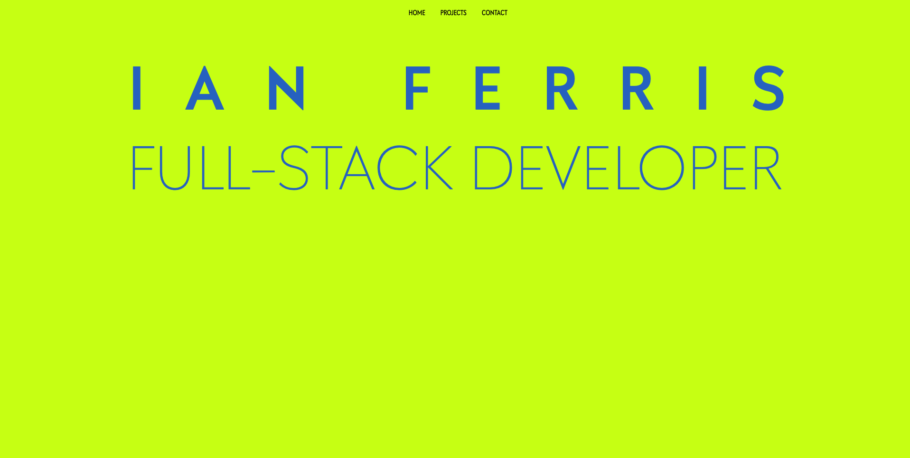

# <h1 align="center">  Portfolio <h1>

## Description

A portfolio page to demonstrate selected projects and build proficiency in CSS. Links to the deployed projects are embedded in the project images. Links to respective Github repositories are the project titles themselves. A downloadable pdf version of my resume is included in this site. 

## Table of Contents 

- [Deployed_Link](#Deployed_Link)
- [Installation](#Installation)
- [Usage](#Usage)
- [Screen_Shot](#Screen_Shot)
- [Credits](#Credits)
- [License](#License)
- [Questions](#Questions)

## Deployed_Link

https://ianjustinferris.github.io/portfolioParallax/

## Installation

N/A

## Usage

N/A

## Screen_Shot

## Credits

Ian Ferris https://github.com/ianjustinferris

## License

https://opensource.org/licenses/MIT

## Questions

ianjustinferris@gmail.com
